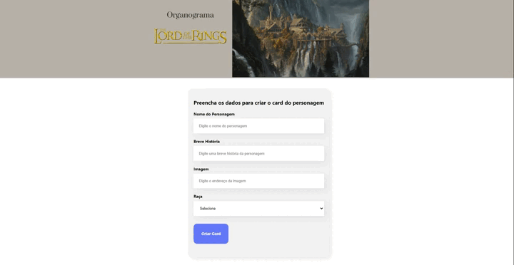

# Organograma Senhor dos Anéis

Um aplicativo criado com React para criar listas dos personagens do universo de Senhor dos Anéis

## Conteúdo deste Readme:

- [Resumo](#resumo)
  - [O Desafio](#o-desafio)
  - [Screenshot](#screenshot)
  - [Preview](#preview)
  - [Deploy](#deploy)
- [Meu processo](#meu-processo)
  - [Projetado com](#projetado-com)
  - [O que eu aprendi](#o-que-eu-aprendi)
- [Autores](#autores)

## Resumo

### O Desafio

O aplicativo tem como objetivo ser de fácil utilização. Criado como forma de praticar a utilização do React, foi realizado durante as aulas do curso de React da Alura. 

O usuário deverá conseguir:

- Preencher o formulário de inserção de novos personagens
- Percorrer a lista de raças dos personagens inseridos (todos filtrados, onde aparecerão apenas as listas que já possuam algum personagem)

### Screenshot

### Preview

### Deploy

Acesse através deste [link](https://organograma-lotr.vercel.app/)

## Processo de Criação

### Projetado com

- React
- React Hooks
- Componentes Reutilizáveis

### O que eu aprendi

🟢 Como iniciar um projeto com React 
🟢 Separação das pastas dos componentes para facilitar a manutençãot 
🟢 Integração entre formulário e o DOM 
🟢 Filtragem das informações de acordo com parâmetros 

## Autor

- [Matheus Trojan](https://www.linkedin.com/in/matheus-trojan/)
